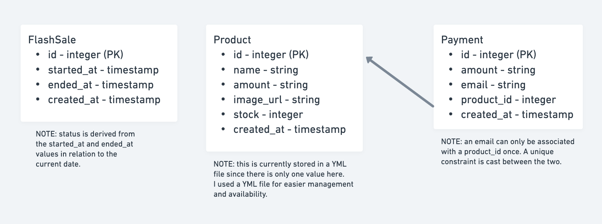

# Flash Sale
## System Design
### Backend
The backend application was structured with domain-driven design in mind. I separated the application logic according to the following layers:
- Controller
- Payload and validation
- Service
- Repository
- Entity
This was done in order to have an easier bird's eye view on each part of the application, and to keep separation of concerns. The setup took a bit of time, but resource development became a lot faster after the foundations have been set up.

The tech stack used is NestJS for the framework and the PostgreSQL for the database.

### Frontend
The frontend application was built with React and functional components. Since the implementation is very simple, I did not opt to include much dependencies on the frontend.

### Infrastructure
The environment was developed and deployed on Docker. There are 2 images created, one for each application, and one for the database.

## System Diagram


## Installation
1. Clone the repository.
```
git clone https://github.com/kebscaballas/flash-sale-app.git && cd flash-sale-app
```
2. Set up the following environment variables:
- `backend/.env`
  ```
  DB_NAME=app
  DB_HOST=db
  DB_USERNAME=postgres
  DB_PASSWORD=postgres
  PRODUCT_YAML_PATH=../../lib/product.yml
  ```
- `frontend/.env`
  ```
  VITE_API_BASE_URL=http://localhost:3000
  ```
3. On the root of project, run the following script: 
```
  docker compose up --build // No need to add --build on succeeding initializations.
```

## Testing
### Unit testing
Unit testing has not been implemented on the API application yet.

### Integration testing
Integration testing for the API application was facilitated using Jest.

To execute the test suite, run the script below:
```
docker compose run --rm api-test
```

### Load testing
Load testing for each endpoint was conducted using K6. Each test consists of the following stages:
1. Target of 10 concurrent users for 30 seconds.
2. Target of 50 concurrent users for 2 minutes.
3. Target of 0 concurrent users for 30 seconds.

To execute the tests for each endpoint, run the following scripts individually:
```
// GET /products
docker run --rm -i --network flash-sale-app_default grafana/k6 run - < ./test/k6/products/get_product.ts

// GET /flash_sales/nearest
docker run --rm -i --network flash-sale-app_default grafana/k6 run - < ./test/k6/flash_sales/get_nearest_flash_sale.ts

// POST /flash_sales
docker run --rm -i --network flash-sale-app_default grafana/k6 run - < ./test/k6/flash_sales/create_flash_sale.ts

// GET /payments
docker run --rm -i --network flash-sale-app_default grafana/k6 run - < ./test/k6/payments/list_payments.ts

// POST /payments
docker run --rm -i --network flash-sale-app_default grafana/k6 run - < ./test/k6/payments/create_payment.ts
```

With my execution, most of the endpoints I fully tested did not have that much issues running under load. The most problematic endpoint seems to be the POST /payments endpoint, which topped at around 56% success rate. Adding indices, setting up max connections, connection timeout, swapping the payment record creation with the product YAML update, and request timeout helped performance by around 10%. Eventually, I realized that it might be because of the lack of transaction management with my current implementation, as well as the usage of the YML file to store the product data. Being able to wrap the repository calls around one transaction might help with this performance.